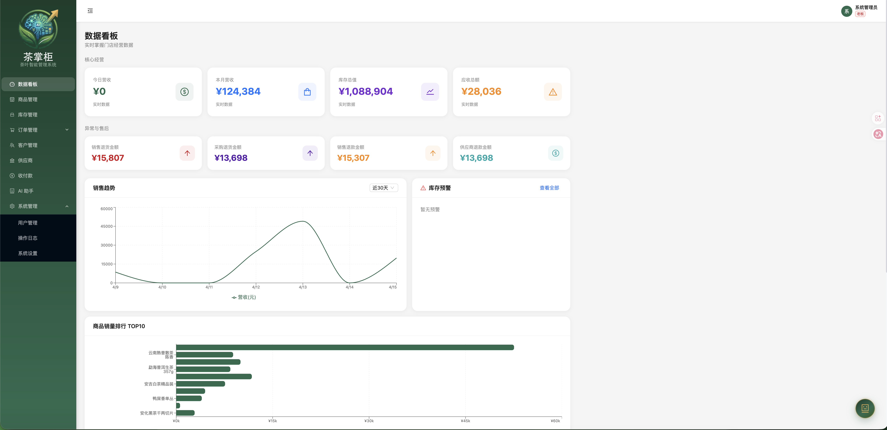
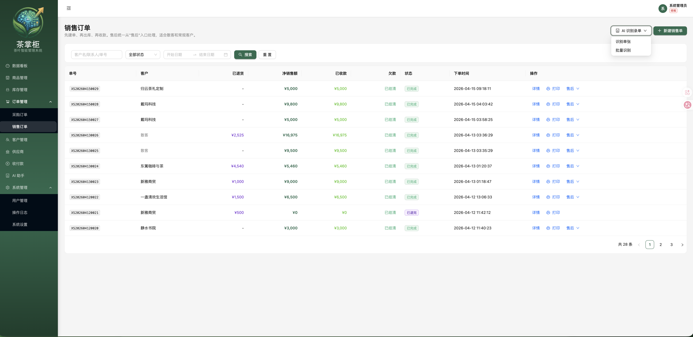
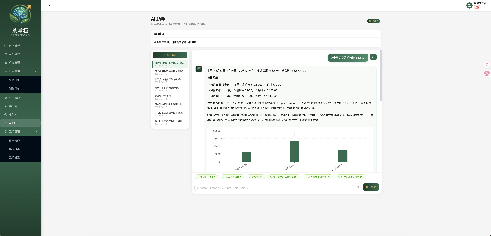
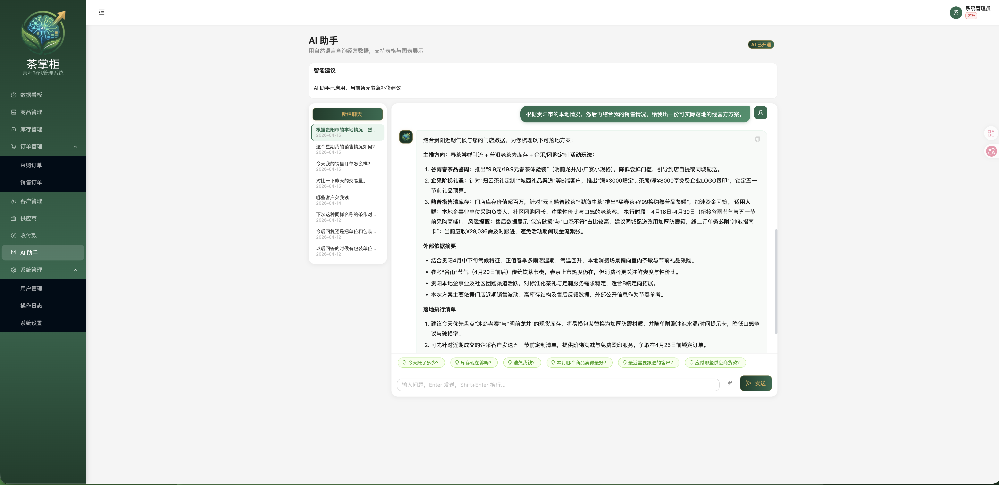
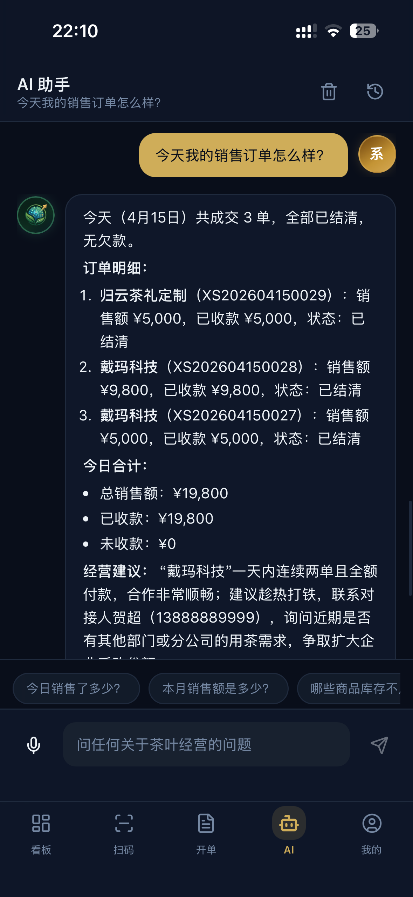
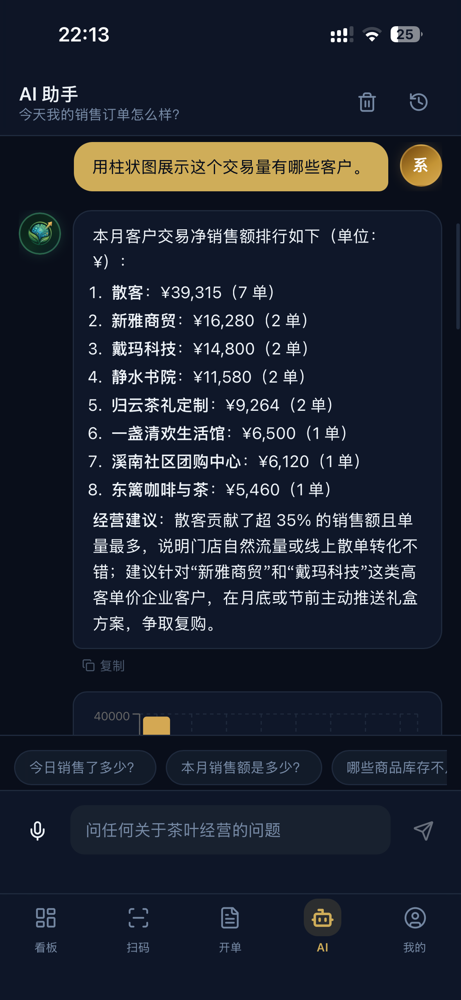
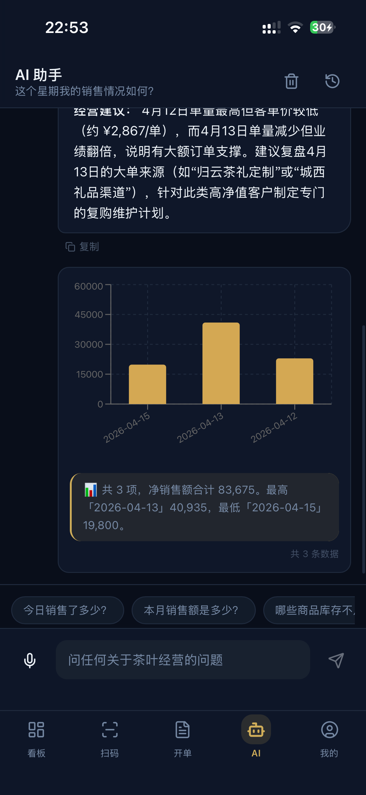
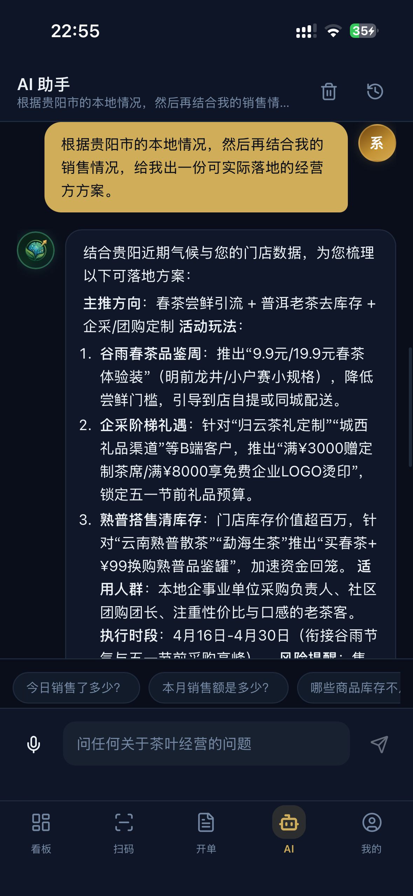

<p align="center">
  
</p>

<h1 align="center">茶掌柜 SmartStock</h1>

<p align="center">
  一套专为茶叶批发零售打造的进销存系统，开箱即用，不折腾。
</p>

<p align="center">
  <a href="#快速开始">快速开始</a> ·
  <a href="#截图预览">截图预览</a> ·
  <a href="#docker-一键部署">Docker 部署</a> ·
  <a href="#ai-功能">AI 功能</a>
</p>

---

## 这是什么

茶掌柜是一套围绕茶叶生意设计的管理系统，不是通用 ERP 改个皮肤。

做茶叶生意的人大概都遇到过这些问题：茶的品类太多，年份、规格、包装方式各不相同，靠表格根本管不过来；客户有的走门店、有的走微信，赊账的、分期付的都有，收款对账全靠记忆；退货退款换货补差价，流程一乱就容易扯皮。

茶掌柜就是为了解决这些事情而做的。它覆盖了商品、库存、销售、采购、客户、收付款的完整流程，Web 端做后台管理，移动端方便外出开单，数据实时同步，开箱就能用。

**适合**：茶店、茶仓、批发档口、区域代理、零售兼批发的门店。

## 核心功能

| 模块 | 说明 |
| --- | --- |
| 数据看板 | 今日营收、本月销售、库存价值、应收总额、销售趋势图、库存预警、热销排行 |
| 商品管理 | 茶类分类、年份、规格、包装单位 / 基础单位换算、SKU 体系 |
| 库存管理 | 入库、出库、盘盈、盘亏、报损，每一笔都有流水可追溯 |
| 销售订单 | 开单、出库、收款、退货、退款、换货，一套流程走完 |
| 采购订单 | 采购下单、入库确认、采购退货 |
| 客户管理 | 客户档案、跟进记录、应收追踪，不再靠脑子记 |
| 供应商管理 | 供应商档案、采购历史 |
| 收付款 | 销售收款、采购付款、应收应付一目了然 |
| 移动端 PWA | 手机开单、查看看板、支持安装到桌面，外出也能用 |
| AI 助手 | 自然语言查经营数据、自动生成图表、图片识别录单（需额外接入，见下文） |

## 截图预览

### Web 端

<table>
  <tr>
    <td align="center"><b>数据看板</b><br/>一眼看清今天的生意</td>
    <td align="center"><b>销售订单</b><br/>开单、收款、退货全在这里</td>
  </tr>
  <tr>
    <td></td>
    <td></td>
  </tr>
</table>

<table>
  <tr>
    <td align="center"><b>AI 助手 - 图表分析</b><br/>问一句话，自动生成可视化图表</td>
    <td align="center"><b>AI 助手 - 经营建议</b><br/>基于真实数据给出落地建议</td>
  </tr>
  <tr>
    <td></td>
    <td></td>
  </tr>
</table>

### 移动端

在手机上也能查数据、做分析、开单子。PWA 应用，不用下载 App，浏览器打开就能用，还能添加到桌面。

<table>
  <tr>
    <td align="center" width="25%"><b>今日销售汇总</b></td>
    <td align="center" width="25%"><b>客户销售排行</b></td>
    <td align="center" width="25%"><b>周销售趋势图</b></td>
    <td align="center" width="25%"><b>AI 经营方案</b></td>
  </tr>
  <tr>
    <td></td>
    <td></td>
    <td></td>
    <td></td>
  </tr>
</table>

## 技术栈

| 模块 | 技术 |
| --- | --- |
| 后端 | NestJS 10、TypeORM、SQLite (sql.js)、JWT、Swagger |
| Web 端 | React 18、Vite、Ant Design 5、ProComponents、Zustand、Recharts |
| 移动端 | React 18、Vite、PWA、Zustand |
| 数据库 | SQLite — 纯 JS 实现 (sql.js)，不用单独装数据库 |

## 开源说明

本仓库开源以下部分，基于 [MIT License](LICENSE)：

```
packages/server     ← NestJS 后端 API
packages/web        ← Web 管理端
packages/mobile     ← 移动端 PWA
packages/shared     ← 前端共享代码
```

**不开单独用也完全没问题** — 不接 AI 服务，茶掌柜就是一套完整的进销存系统，商品、库存、销售、采购、客户管理全都能正常使用。

AI 功能属于增值服务，需要额外接入，详见 [AI 功能](#ai-功能) 章节。

## 快速开始

### 环境要求

- Node.js >= 18
- pnpm >= 10

### 三步跑起来

```bash
# 1. 安装依赖
pnpm install

# 2. 配置环境变量
cp packages/server/.env.example packages/server/.env
```

首次启动会根据 `.env` 自动创建管理员账号，默认配置：

```env
DEFAULT_ADMIN_USERNAME=admin
DEFAULT_ADMIN_PASSWORD=Admin@123456
```

```bash
# 3. 启动开发服务（后端 + Web + Mobile 全部启动）
pnpm dev:all
```

### 访问地址

| 服务 | 地址 |
| --- | --- |
| Web 管理端 | `http://localhost:8080` |
| 移动端 | `https://localhost:8081` |
| API 文档 (Swagger) | `http://localhost:3000/api/docs` |

> 移动端默认启用 HTTPS，方便真机调试摄像头等能力。如果只是本地调试，可以关闭：
> ```bash
> VITE_MOBILE_HTTPS=false pnpm dev:mobile
> ```

### 其他命令

```bash
pnpm dev           # 只启动后端 + Web
pnpm dev:server    # 只启动后端
pnpm dev:web       # 只启动 Web
pnpm dev:mobile    # 只启动移动端
pnpm build:server  # 构建后端
pnpm build:web     # 构建 Web
```

## Docker 一键部署

一个容器跑完所有服务，部署门槛很低。

### 谁适合用 Docker 部署

茶掌柜不要求你一定有云服务器。对于个人店铺、小团队或门店自用，一台普通电脑就够了 — Docker 启动后，局域网内的设备都能直接访问。

如果需要手机在外面也能用，或者让分店远程访问，可以配合内网穿透工具把服务暴露出去。

简单理解：

- **店内使用**：一台电脑 + Docker
- **远程访问**：一台电脑 + Docker + 内网穿透

> 如果是多人长期在线、跨地区协作、对稳定性要求高，还是建议上云服务器。

### 部署步骤

```bash
# 1. 配置环境变量
cp packages/server/.env.example packages/server/.env

# 2. 启动
docker compose up -d --build
```

部署完成后的访问地址：

| 服务 | 地址 |
| --- | --- |
| Web 管理端 | `http://localhost/` |
| 移动端 | `http://localhost/m/` |
| API 文档 | `http://localhost/api/docs` |

### 常用命令

```bash
docker compose ps        # 查看状态
docker compose logs -f   # 查看日志
docker compose down      # 停止服务
```

### 数据持久化

SQLite 数据库文件挂载到宿主机，不会因为容器重建丢数据：

```
./data → /app/packages/server/data/app.db
```

## 目录结构

```
smartstock/
├── packages/
│   ├── server/          # NestJS 后端 API
│   ├── web/             # Web 管理端
│   ├── mobile/          # 移动端 PWA
│   └── shared/          # 前端共享代码
├── deploy/              # Docker / Nginx 部署配置
├── docker-compose.yml
├── Dockerfile
└── pnpm-workspace.yaml
```

## AI 功能

AI 功能是茶掌柜的增值能力，**不影响主程序使用**，需要单独接入作者提供的 AI Agent 服务。

### AI 能做什么

- **自然语言查数据**：问"这个月卖了多少钱"，直接给你答案
- **自动生成图表**：问"用柱状图展示客户销售排行"，图表直接出来
- **经营分析建议**：基于你的真实销售数据，给出可落地的经营建议
- **图片识别录单**：拍照或截图，AI 自动识别订单内容并录入

### 如何接入

AI 服务通过以下配置连接（已在 `.env.example` 中预留）：

```env
AI_API_KEY=xxx
AI_PROMPT_SERVICE_URL=xxx
```

如果你对 AI 功能感兴趣，扫码加我微信聊：

<p align="center">
  
  <br />
  <em>扫码添加微信，了解 AI 服务接入</em>
</p>

## 项目特点

- **开箱即用** — SQLite 嵌入式数据库，不用装 MySQL，clone 下来就能跑
- **双端覆盖** — Web 做管理，手机开单子，数据实时同步
- **茶行业适配** — 围绕茶叶规格、年份、包装和熟客交易习惯设计，不是通用模板
- **部署简单** — Docker 一个容器搞定，普通电脑就能跑
- **AI 可选** — 主程序独立可用，AI 能力按需接入，不绑定

## 怎么用比较好

1. 先把它当一套免费的进销存用起来，跑通商品、库存、销售、采购、客户流程
2. 用熟了之后，如果想要 AI 查数据、AI 录单的能力，再联系我接入
3. 有任何问题或建议，欢迎提 Issue 或者加微信聊

## License

[MIT License](LICENSE) — 开源范围为本仓库中的代码。AI Agent 服务及 prompt-center 不在开源范围内。

---

<p align="center">
  如果这个项目对你有帮助，欢迎点个 Star，这是对我最大的鼓励。
</p>
